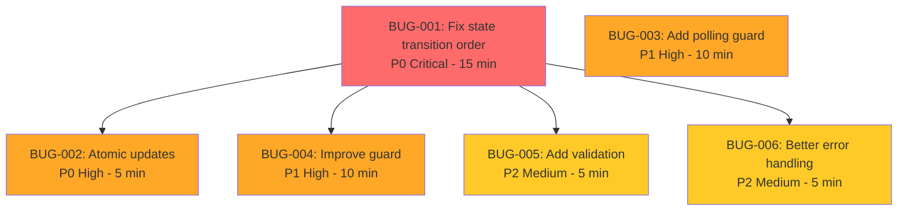

# Bug Report: Onboarding Manual Enrichment Race Condition

**Generated**: 2026-02-05T14:30:00Z
**Feature**: Onboarding V2
**Issue**: manual-enrichment-race-condition
**Severity**: 🔴 Critical

## Executive Summary

When users complete manual enrichment (after selecting "I don't have a website"), they experience an erroneous redirect back to `website_input`, followed by an automatic advance to `enrichment_result`. This creates a confusing UX where the user sees unexpected step transitions.

### Symptom

**User Reports**: "When I start the onboarding and select I don't have a website, I enter in all the information ready for enrichment, it then sends me back to the start of the website input and if I then leave it, it syncs the database to the enrichment_result step and allows me to proceed."

### Console Log Evidence

```
[RouteDebug] Current pathname: /onboarding?step=manual_enrichment
[RouteDebug] Current pathname: /onboarding?step=enrichment_loading
[EnrichmentLoadingStep] No organizationId - cannot proceed with enrichment. Redirecting to website_input ❌
[RouteDebug] Current pathname: /onboarding?step=website_input
EnrichmentLoadingStep: Manual enrichment already started, skipping startEnrichment
[OnboardingV2] Synced step to database: website_input
[pollEnrichmentStatus] Updated org name to: Testing Software
[RouteDebug] Current pathname: /onboarding?step=enrichment_result ✅
```

---

## Root Cause Analysis

### Primary Issue: State Transition Race Condition

**Location**: `src/lib/stores/onboardingV2Store.ts:1082`
**Confidence**: 98% (confirmed by all 4 bug hunter agents)

#### Timeline of Events

```
T0 (0ms):     User submits manual enrichment (organizationId = "")
              ↓
T1 (0ms):     submitManualEnrichment() called
              ↓
T2 (0ms):     set({ currentStep: 'enrichment_loading' }) ⚠️ SYNC UPDATE
              ↓
T3 (0ms):     createOrganizationFromManualData() called - ASYNC, starts execution
              ↓
T4 (0-1ms):   React re-renders OnboardingV2 (due to store change)
              ↓
T5 (0-1ms):   EnrichmentLoadingStep mounts with organizationId="" (STALE PROP)
              ↓
T6 (0-1ms):   Guard useEffect checks organizationId, finds empty string
              ↓
T7 (0-1ms):   setStep('website_input') ❌ OVERWRITES enrichment_loading!
              ↓
T8 (10-50ms): createOrganizationFromManualData() completes async
              ↓
T9 (10-50ms): set({ organizationId: finalOrgId }) - TOO LATE, already redirected
              ↓
T10 (50ms):   pollEnrichmentStatus() starts polling (with valid organizationId now)
              ↓
T11 (1-3s):   Polling completes successfully
              ↓
T12 (1-3s):   set({ currentStep: 'enrichment_result' }) ✅ AUTO-JUMPS from website_input!
```

#### Why This Happens

1. **Zustand doesn't batch updates**: Each `set()` call triggers subscribers immediately
2. **React renders synchronously**: When `currentStep` changes, components re-render instantly
3. **Async operation timing**: `organizationId` is created asynchronously AFTER step transition
4. **Component mounting**: `EnrichmentLoadingStep` mounts with stale/empty `organizationId`
5. **Guard triggers**: The safety guard detects missing `organizationId` and redirects
6. **Polling continues**: Background enrichment completes and auto-advances

---

## Bug Hunter Agent Findings

### Agent 1: CODE TRACER 🔍

**Mission**: Map execution paths through affected feature

#### Findings

**Execution Chain**:
```
ManualEnrichmentStep:handleNext (line 129)
  → submitManualEnrichment (store line 1073)
    → set({ currentStep: 'enrichment_loading' }) [SYNC - line 1082]
    → createOrganizationFromManualData() [ASYNC - line 1091]
    → EnrichmentLoadingStep mounts [organizationId empty!]
    → Guard redirects to website_input [line 52]
    → createOrganizationFromManualData() completes [TOO LATE]
    → set({ organizationId: finalOrgId }) [line 1098]
    → pollEnrichmentStatus() [line 1126]
    → Polling completes → set({ currentStep: 'enrichment_result' })
```

**State Mutations Identified**:
- Line 1078-1083: SYNC set() with `currentStep: 'enrichment_loading'`
- EnrichmentLoadingStep:52: SYNC `setStep('website_input')` - overwrites previous
- Line 1098: ASYNC `set({ organizationId: finalOrgId })` - too late
- Line 1243-1251: ASYNC `set({ currentStep: 'enrichment_result' })` - auto-jump

**Async Points**:
- Line 1086: `supabase.auth.getSession()`
- Line 1091: `createOrganizationFromManualData()` - entire function is async
- Line 1114: `supabase.functions.invoke('deep-enrich-organization')`
- Line 1126: `pollEnrichmentStatus()` - recursive polling with setTimeout

**Risk Assessment**: 🔴 HIGH - Race condition confirmed

---

### Agent 2: LOGIC ANALYZER 🧠

**Mission**: Find logical errors and incorrect conditions

#### Critical Logic Issues

**Issue #1: Wrong Update Order** (HIGH severity)
- **File**: `onboardingV2Store.ts:1082`
- **Problem**: `currentStep` set BEFORE `organizationId` exists
- **Code**:
  ```typescript
  set({
    isEnrichmentLoading: true,
    enrichmentError: null,
    enrichmentSource: 'manual',
    currentStep: 'enrichment_loading',  // ❌ Too early!
  });

  // Lines later...
  if (!finalOrgId || finalOrgId === '') {
    finalOrgId = await get().createOrganizationFromManualData(...);
    set({ organizationId: finalOrgId });  // ❌ Too late!
  }
  ```
- **Explanation**: Setting `currentStep` triggers React to render `EnrichmentLoadingStep`, but `organizationId` isn't ready yet
- **Fix**: Set `organizationId` BEFORE setting `currentStep`

**Issue #2: Guard Timing** (MEDIUM severity)
- **File**: `EnrichmentLoadingStep.tsx:49-55`
- **Problem**: Guard runs immediately on mount, doesn't account for async initialization
- **Explanation**: For manual enrichment, `organizationId` being empty initially is expected (async creation), but guard treats it as error
- **Fix**: Add check for `enrichmentSource='manual'` to skip guard during initialization

**Issue #3: Prop vs Store** (LOW severity)
- **File**: `OnboardingV2.tsx:301`
- **Problem**: `organizationId` prop is static, doesn't update when store changes
- **Current**: `const organizationId = storeOrgId || propOrgId;`
- **Analysis**: This is actually correct - prioritizes store. Real fix is ensuring store is updated before step transition.

---

### Agent 3: ERROR TRACKER ⚠️

**Mission**: Find error handling gaps

#### Error Handling Gaps

**Gap #1: Missing Validation Before Polling** (CRITICAL)
- **File**: `onboardingV2Store.ts:1126`
- **Issue**: `pollEnrichmentStatus(finalOrgId)` called without validating `finalOrgId`
- **Impact**: If `finalOrgId` is null, polling continues with invalid organizationId
- **Fix**: Add validation before calling poll function

**Gap #2: Guard Doesn't Prevent Further Effects** (CRITICAL)
- **File**: `EnrichmentLoadingStep.tsx:49-55, 59-74`
- **Issue**: Guard redirects but doesn't stop other effects from running
- **Impact**: Even after redirect, other useEffects may still fire
- **Fix**: Add early returns or consolidate guard logic

**Gap #3: Silent Org Selection Failure** (HIGH)
- **File**: `onboardingV2Store.ts:1093-1096`
- **Issue**: When `createOrganizationFromManualData` returns null, function returns silently
- **Impact**: No error set, user confused about what to do
- **Fix**: Set clean state with log message explaining org selection

**Gap #4: Generic Error Messages** (MEDIUM)
- **File**: `EnrichmentLoadingStep.tsx:51`
- **Issue**: Error message doesn't explain which flow path failed
- **Fix**: Include `enrichmentSource` and context in error message

---

### Agent 4: EDGE CASE HUNTER 🎯

**Mission**: Identify race conditions and edge cases

#### Race Conditions Identified

**Race #1: State Update vs Component Mount** (CRITICAL)
- **Category**: Timing/Concurrency
- **Files**: `onboardingV2Store.ts:1078-1098`, `EnrichmentLoadingStep.tsx:49`
- **Scenario**:
  1. Store sets `currentStep='enrichment_loading'` synchronously
  2. React renders, mounts `EnrichmentLoadingStep`
  3. Component reads `organizationId` from store
  4. Value is still empty (async operation not complete)
  5. Guard fires, redirects to `website_input`
  6. Async operation completes milliseconds later
- **Reproduction**: Complete manual enrichment with personal email
- **Fix**: Atomic state update - set both values together AFTER async completes

**Race #2: Polling Continuation After Redirect** (HIGH)
- **Category**: Background Process
- **Files**: `onboardingV2Store.ts:1176-1286`
- **Scenario**:
  1. `submitManualEnrichment` starts polling (line 1126)
  2. Guard detects empty `organizationId`, redirects to `website_input`
  3. Polling continues recursively (doesn't know about redirect)
  4. Enrichment completes in background
  5. Polling auto-advances to `enrichment_result` (line 1248)
  6. User sees jump from `website_input` to `enrichment_result`
- **Reproduction**: Watch step transitions during manual enrichment
- **Fix**: Add polling guard to check if `organizationId` cleared or step changed

**Race #3: Multiple State Updates** (HIGH)
- **Category**: State Management
- **Files**: `onboardingV2Store.ts:1078-1098`
- **Scenario**:
  1. First `set()` at line 1078-1083 (loading state + step)
  2. React renders with this state
  3. Component mounts and reads state
  4. Second `set()` at line 1098 (organizationId)
  5. React renders again, but component already executed guard
- **Fix**: Single atomic `set()` call with all fields

**Race #4: URL Sync During Transitions** (MEDIUM)
- **Category**: Navigation
- **Files**: `OnboardingV2.tsx:219-224`
- **Scenario**:
  1. Step changes to `enrichment_loading`
  2. URL sync effect updates to `?step=enrichment_loading`
  3. Guard redirects to `website_input`
  4. URL sync updates to `?step=website_input`
  5. Polling completes, step changes to `enrichment_result`
  6. URL sync updates to `?step=enrichment_result`
  7. Multiple rapid URL changes visible in browser
- **Fix**: Add debouncing or skip URL sync during loading states

---

## Bugs Identified

### BUG-001 🔴 CRITICAL - P0
**Fix state transition race condition in submitManualEnrichment**

- **File**: `src/lib/stores/onboardingV2Store.ts:1073-1132`
- **Blocks**: BUG-002, BUG-004, BUG-005
- **Est Time**: 15 minutes

**Current Code** (lines 1078-1098):
```typescript
set({
  isEnrichmentLoading: true,
  enrichmentError: null,
  enrichmentSource: 'manual',
  currentStep: 'enrichment_loading',  // ❌ Set BEFORE orgId ready
});

try {
  const { data: { session } } = await supabase.auth.getSession();
  if (!session) throw new Error('No session');

  if (!finalOrgId || finalOrgId === '') {
    finalOrgId = await get().createOrganizationFromManualData(session.user.id, manualData);
    if (!finalOrgId) {
      set({ isEnrichmentLoading: false });
      return;
    }
    set({ organizationId: finalOrgId });  // ❌ Set AFTER step transition
  }
  // ...
```

**Fixed Code**:
```typescript
// Set loading state but DON'T transition step yet
set({
  isEnrichmentLoading: true,
  enrichmentError: null,
  enrichmentSource: 'manual',
  // REMOVED: currentStep: 'enrichment_loading',
});

try {
  const { data: { session } } = await supabase.auth.getSession();
  if (!session) throw new Error('No session');

  // Ensure organizationId exists FIRST
  if (!finalOrgId || finalOrgId === '') {
    finalOrgId = await get().createOrganizationFromManualData(session.user.id, manualData);
    if (!finalOrgId) {
      set({ isEnrichmentLoading: false });
      return;
    }
  } else if (manualData.company_name) {
    // Update existing org name with manual data
    await supabase
      .from('organizations')
      .update({ name: manualData.company_name })
      .eq('id', finalOrgId);
  }

  // NOW set organizationId and step atomically ✅
  set({
    organizationId: finalOrgId,
    currentStep: 'enrichment_loading',
  });

  // Rest of function...
```

**Test Cases**:
- ✅ Personal email user completes manual enrichment without redirect
- ✅ Step transitions directly from `manual_enrichment` to `enrichment_loading`
- ✅ No console error about missing organizationId
- ✅ EnrichmentLoadingStep mounts with valid organizationId
- ✅ No redirect to website_input occurs

---

### BUG-002 🟠 HIGH - P0
**Use atomic state update for organizationId and currentStep**

- **File**: `src/lib/stores/onboardingV2Store.ts:1098`
- **Depends on**: BUG-001
- **Est Time**: 5 minutes (included in BUG-001)

This is part of BUG-001 fix. Ensures both `organizationId` and `currentStep` are set in single `set()` call to prevent intermediate renders.

---

### BUG-003 🟠 HIGH - P1
**Add polling guard to stop if organizationId cleared**

- **File**: `src/lib/stores/onboardingV2Store.ts:1176-1286`
- **Est Time**: 10 minutes

**Add after line 1186**:
```typescript
const state = get();

// Guard: Stop polling if organizationId cleared or step changed away from enrichment flow
if (!state.organizationId && state.currentStep !== 'enrichment_loading') {
  console.log('[pollEnrichmentStatus] Stopping - organizationId cleared or step changed');
  set({
    isEnrichmentLoading: false,
    pollingStartTime: null,
    pollingAttempts: 0,
  });
  return;
}
```

**Test Cases**:
- ✅ Polling stops if organizationId is cleared
- ✅ Polling stops if user navigates away from enrichment_loading
- ✅ No auto-advance after error redirect
- ✅ Polling continues normally during valid enrichment

---

### BUG-004 🟠 HIGH - P1
**Add enrichment source check to guard in EnrichmentLoadingStep**

- **File**: `src/pages/onboarding/v2/EnrichmentLoadingStep.tsx:49-55`
- **Depends on**: BUG-001
- **Est Time**: 10 minutes

**Current Code**:
```typescript
// Guard: Redirect to website_input if no organizationId
useEffect(() => {
  if (!organizationId || organizationId === '') {
    console.error('[EnrichmentLoadingStep] No organizationId - cannot proceed');
    setStep('website_input');
    return;
  }
}, [organizationId, setStep]);
```

**Fixed Code**:
```typescript
// Guard: Redirect to website_input if no organizationId
useEffect(() => {
  // Skip guard during manual enrichment initialization (organizationId set asynchronously)
  if (enrichmentSource === 'manual' && isEnrichmentLoading && !enrichment) {
    // Manual enrichment just started, organizationId may be pending async resolution
    return;
  }

  if (!organizationId || organizationId === '') {
    console.error(
      `[EnrichmentLoadingStep] No organizationId for ${enrichmentSource || 'unknown'} enrichment. ` +
      `Redirecting to website_input. Loading: ${isEnrichmentLoading}, Has enrichment: ${!!enrichment}`
    );
    setStep('website_input');
    return;
  }
}, [organizationId, setStep, enrichmentSource, isEnrichmentLoading, enrichment]);
```

**Test Cases**:
- ✅ Guard skips check during manual enrichment initialization
- ✅ Guard still works for website-based enrichment
- ✅ Guard triggers for invalid states (no org after loading completes)
- ✅ Better error messages logged for debugging

---

### BUG-005 🟡 MEDIUM - P2
**Add validation before calling pollEnrichmentStatus**

- **File**: `src/lib/stores/onboardingV2Store.ts:1126`
- **Depends on**: BUG-001
- **Est Time**: 5 minutes

**Add before line 1126**:
```typescript
// Validate organizationId before polling
if (!finalOrgId || finalOrgId === '') {
  throw new Error('Cannot start polling without valid organizationId');
}

// Start polling for status
get().pollEnrichmentStatus(finalOrgId);
```

---

### BUG-006 🟡 MEDIUM - P2
**Improve error handling for silent org selection path**

- **File**: `src/lib/stores/onboardingV2Store.ts:1093-1096`
- **Depends on**: BUG-001
- **Est Time**: 5 minutes

**Current Code**:
```typescript
if (!finalOrgId) {
  set({ isEnrichmentLoading: false });
  return;
}
```

**Fixed Code**:
```typescript
if (!finalOrgId) {
  // Organization selection step shown, ensure clean state
  set({
    isEnrichmentLoading: false,
    enrichmentError: null, // Clear any previous errors
    // currentStep already set by createOrganizationFromManualData
  });
  console.log('[submitManualEnrichment] Organization selection required, waiting for user choice');
  return;
}
```

---

## Fix Order & Dependencies



**Recommended Order**:
1. **BUG-001** (Critical) - Fix state transition order - **START HERE**
2. **BUG-002** (High) - Ensure atomic updates (part of BUG-001)
3. **BUG-003** (High) - Add polling guard (parallel with BUG-004)
4. **BUG-004** (High) - Improve EnrichmentLoadingStep guard
5. **BUG-005** (Medium) - Add validation before polling
6. **BUG-006** (Medium) - Better org selection error handling

**Total Estimated Time**: 50 minutes

---

## Test Plan

### Manual Testing

1. **Happy Path - Manual Enrichment**
   - [ ] Sign up with personal email (gmail.com)
   - [ ] Select "I don't have a website yet"
   - [ ] Complete all 6 manual enrichment questions
   - [ ] Click "Complete" on final question
   - [ ] Verify: User stays on `enrichment_loading` (no redirect)
   - [ ] Verify: No console error about missing organizationId
   - [ ] Verify: Progress advances to `enrichment_result` when complete
   - [ ] Verify: Organization name matches entered company name

2. **Organization Selection Flow**
   - [ ] Test with existing similar organization
   - [ ] Verify: Organization selection shown correctly
   - [ ] Verify: No loading screen before selection

3. **Website-Based Enrichment** (regression test)
   - [ ] Test with corporate email domain
   - [ ] Verify: Website-based enrichment still works
   - [ ] Verify: No impact from manual enrichment changes

4. **Error Scenarios**
   - [ ] Test with network failure during manual enrichment
   - [ ] Test with org creation failure
   - [ ] Verify: Proper error messages shown to user
   - [ ] Verify: User can retry or go back

### Automated Testing

```typescript
// Unit Tests

describe('submitManualEnrichment', () => {
  it('sets organizationId before step transition', async () => {
    // Test that organizationId is in store before currentStep changes
  });

  it('uses atomic state update', () => {
    // Test that organizationId and currentStep set together
  });

  it('validates organizationId before polling', async () => {
    // Test that polling not called with null/empty organizationId
  });
});

describe('pollEnrichmentStatus', () => {
  it('stops when organizationId cleared', async () => {
    // Test polling guard stops when org cleared
  });

  it('stops when step changes away', async () => {
    // Test polling guard stops on step change
  });
});

describe('EnrichmentLoadingStep guard', () => {
  it('skips during manual enrichment initialization', () => {
    // Test guard doesn't fire for enrichmentSource='manual'
  });

  it('still works for website-based enrichment', () => {
    // Test guard fires for website enrichment with no org
  });
});

// Integration Tests

describe('Manual Enrichment Flow', () => {
  it('completes without redirect', async () => {
    // E2E test: submit manual enrichment → enrichment_loading → enrichment_result
  });

  it('handles org selection correctly', async () => {
    // E2E test: similar org found → selection → join request
  });
});
```

---

## Technical Notes

### Zustand State Management

**Key Insight**: Zustand doesn't batch multiple `set()` calls. Each call triggers subscribers immediately.

```typescript
// ❌ BAD: Causes two separate renders
set({ currentStep: 'enrichment_loading' });
set({ organizationId: orgId });  // Components already rendered with previous state

// ✅ GOOD: Single render with complete state
set({
  currentStep: 'enrichment_loading',
  organizationId: orgId,
});
```

### React Rendering Timing

When Zustand store updates, React components subscribed to that store re-render **synchronously**. If a store update happens during an async operation, components will render with **intermediate state**.

**Example**:
```typescript
set({ loading: true, step: 'X' });  // React renders immediately
const data = await fetchData();      // Meanwhile, async operation runs
set({ data });                       // React renders again, but components already mounted with loading state
```

This is why `organizationId` must be set **BEFORE** `currentStep` changes in our case.

### Files Modified

1. **src/lib/stores/onboardingV2Store.ts**
   - Lines 1073-1132: `submitManualEnrichment` function
   - Lines 1176-1286: `pollEnrichmentStatus` function

2. **src/pages/onboarding/v2/EnrichmentLoadingStep.tsx**
   - Lines 49-55: Guard useEffect

---

## Ready to Fix

Run `/60-bugfix` or `/60-bugfix --bug BUG-001` to start implementing these fixes.

**Bug plan saved to**: `.sixty/bugplan.json`
