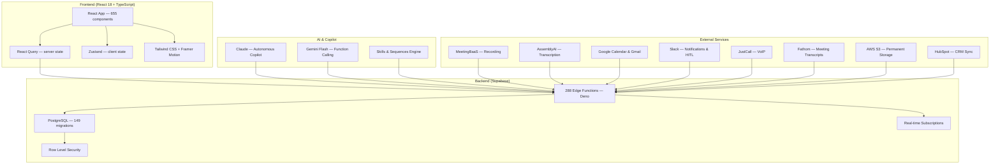
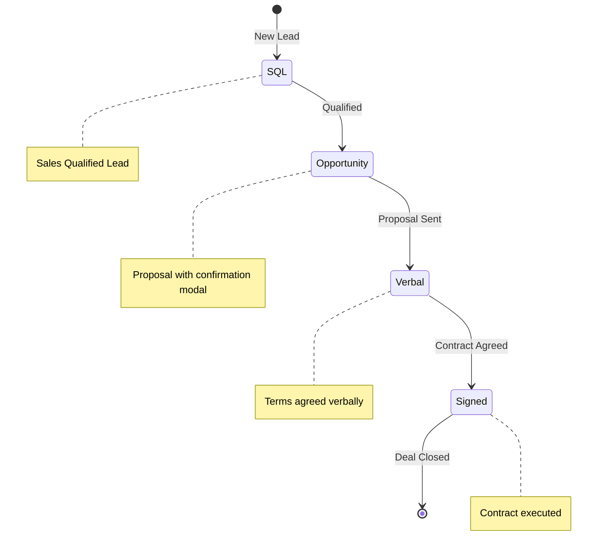

# use60 Documentation

Sales intelligence platform — pre & post meeting command centre with AI copilot, pipeline tracking, and smart task automation.

## Documentation Map

| Section | Files | Description |
|---------|-------|-------------|
| [Architecture](./architecture/) | 8 | System design, process maps, data models, Mermaid flows |
| [Copilot](./copilot/) | 11 | AI copilot system — skills, sequences, personas, HITL |
| [Product](./product/) | 15 | PRDs, feature briefs, competitive research, planning |
| [Integrations](./integrations/) | 19 | HubSpot, MeetingBaaS, AssemblyAI, Slack, S3, Calendar |
| [Guides](./guides/) | 31 | Developer guides, user guides, CRM, pipeline, admin |
| [API](./api/) | 4 | REST API reference, quickstart, testing specs |
| [Deployment](./deployment/) | 8 | Production deploy, staging setup, migrations, DevOps |
| [Security](./security/) | 3 | Hardening guide, implementation summary, audit tracking |
| [Testing](./testing/) | 11 | QA checklists, Playwright setup, copilot lab testing |
| [Performance](./performance/) | 4 | Optimization guides, metrics framework, CRM performance |

---

## System Overview



---

## 4-Stage Sales Pipeline



---

## Tech Stack

| Layer | Technology | Purpose |
|-------|------------|---------|
| Frontend | React 18 + TypeScript | UI Components (655 .tsx files) |
| Build | Vite | Fast development & builds |
| Styling | Tailwind CSS | Utility-first CSS |
| Animation | Framer Motion | Smooth transitions |
| Client State | Zustand | UI state, preferences, active org |
| Server State | React Query | Data fetching, caching, real-time sync |
| Backend | Supabase | BaaS platform (PostgreSQL, Edge Functions, RLS, Realtime) |
| Functions | 288 Deno Edge Functions | Serverless APIs |
| AI | Claude (Anthropic) + Gemini (Google) | Autonomous copilot with tool use |
| Auth | Supabase Auth (primary) + Clerk (legacy) | Dual auth support |
| Storage | AWS S3 | Permanent meeting recording storage |
| Hosting | Vercel | Frontend deployment |

---

## Project Structure

```
sixty-sales-dashboard/
├── src/                        # Frontend React application
│   ├── components/             # 655 React components
│   │   ├── copilot/            # Copilot UI (chat, tools, panels)
│   │   ├── platform/           # Platform features (sequences, skills)
│   │   └── ui/                 # Radix UI primitives
│   ├── pages/                  # Route components
│   ├── lib/
│   │   ├── configuration/      # Feature flags (ApplicationConfig)
│   │   ├── contexts/           # React contexts (CopilotContext)
│   │   ├── copilot/agent/      # Autonomous executor, orchestration
│   │   ├── hooks/              # Custom React hooks
│   │   ├── sequences/          # SequenceOrchestrator
│   │   ├── services/           # API services + ServiceLocator DI
│   │   ├── stores/             # Zustand stores
│   │   ├── types/              # TypeScript types
│   │   └── utils/              # Utility functions
│   └── lib/prompts/            # AI prompt templates & process map generation
├── supabase/
│   ├── migrations/             # 149 database migrations
│   └── functions/              # 288 Edge Functions (Deno)
├── packages/landing/           # Marketing site (Vite, port 5173)
├── tests/                      # Test suites
└── docs/                       # This documentation
```

---

## Environments

| Environment | Project Ref | URL | npm Script |
|-------------|-------------|-----|------------|
| **Production** | `ygdpgliavpxeugaajgrb` | app.use60.com | `npm run dev:production` |
| **Staging** | `caerqjzvuerejfrdtygb` | — | `npm run dev:staging` |
| **Development** | `wbgmnyekgqklggilgqag` | localhost:5175 | `npm run dev` |

---

## Quick Start

```bash
# Install dependencies
npm install

# Start development (port 5175, uses .env.development)
npm run dev

# Start with staging Supabase
npm run dev:staging

# Production build
npm run build

# Run tests
npm run test

# E2E tests
npm run playwright
```

---

## Process Maps

The codebase includes a **two-phase AI process map generation system**:

1. **Phase 1 (Claude Opus)**: Analyzes features → generates `ProcessStructure` JSON (source of truth)
2. **Phase 2 (Claude Haiku)**: Converts JSON → renders Mermaid flowcharts

Key files:
- `src/lib/prompts/processMapPrompts.ts` — Integration & workflow descriptions
- `src/lib/types/processMapTesting.ts` — Type definitions for test engine
- `src/lib/testing/converters/processStructureConverter.ts` — Structure → workflow converter

Supported integrations: HubSpot, Fathom, Google (Calendar/Gmail), Slack, JustCall, SavvyCal, MeetingBaaS, Supabase.

---

## Key Reference Documents

| Document | Purpose |
|----------|---------|
| [CLAUDE.md](../CLAUDE.md) | Complete project context for AI assistants (root) |
| [Copilot Process Map](./architecture/COPILOT_PROCESS_MAP.md) | 5-phase copilot request flow with safety measures |
| [PRD: Proactive AI Teammate](./product/PRD_PROACTIVE_AI_TEAMMATE.md) | Core product vision |
| [Skill Frontmatter Guide](./copilot/SKILL_FRONTMATTER_GUIDE.md) | V2 skill specification |
| [Security Hardening Guide](./security/SECURITY_HARDENING_GUIDE.md) | Defense-in-depth architecture |
| [API Reference](./api/API_REFERENCE.md) | REST API endpoints |
