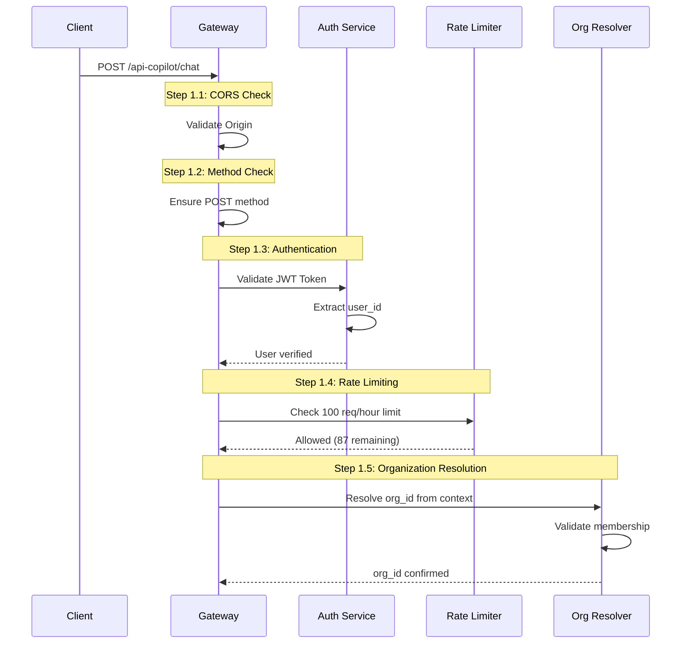
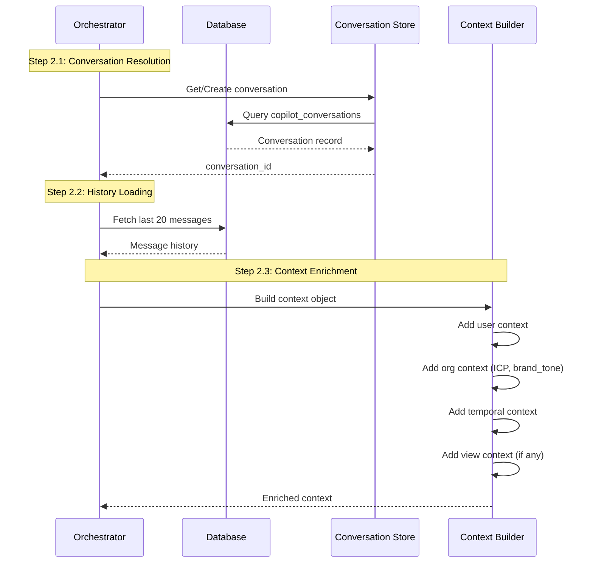
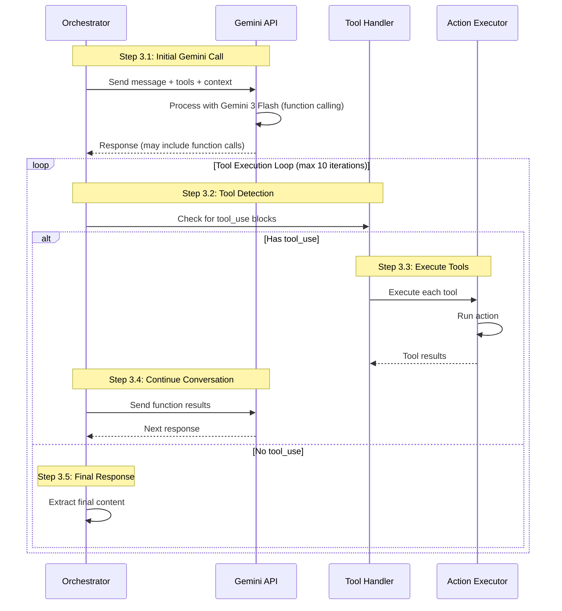
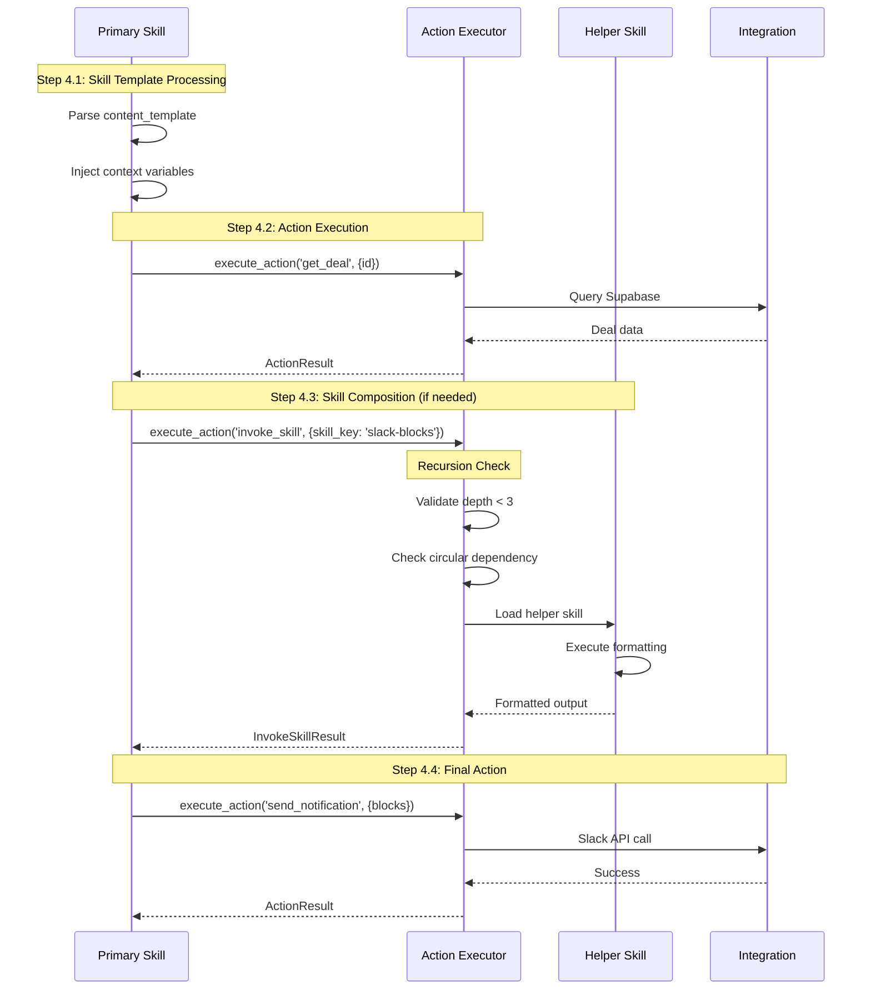
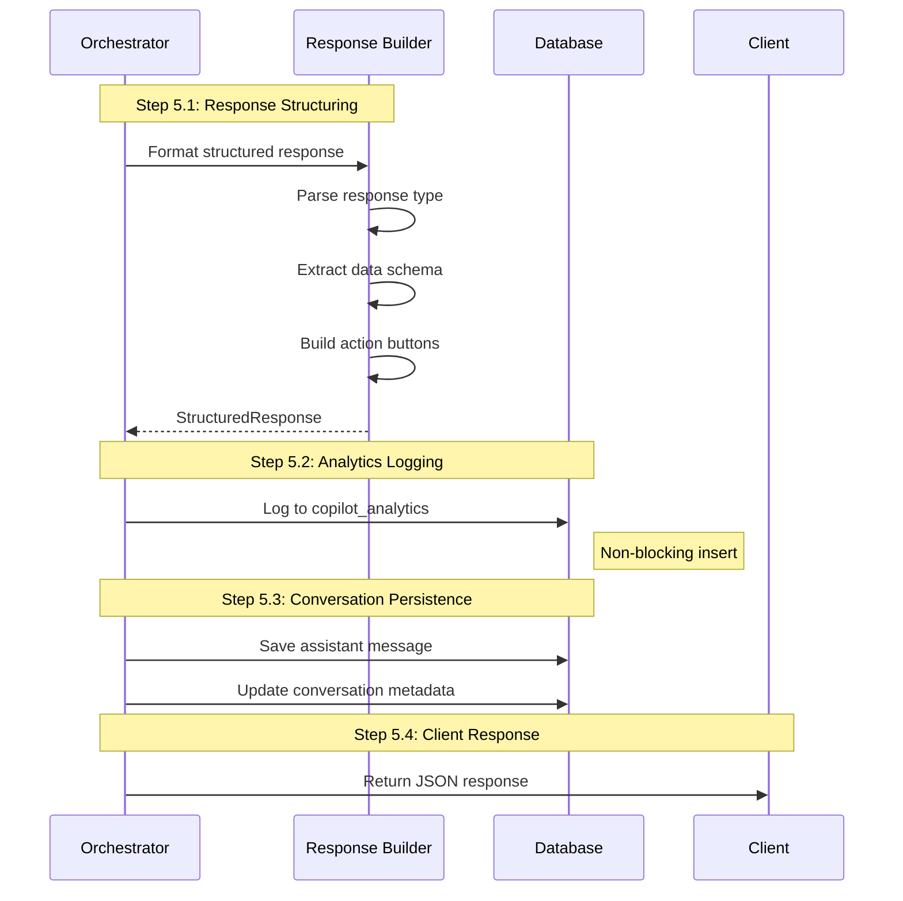
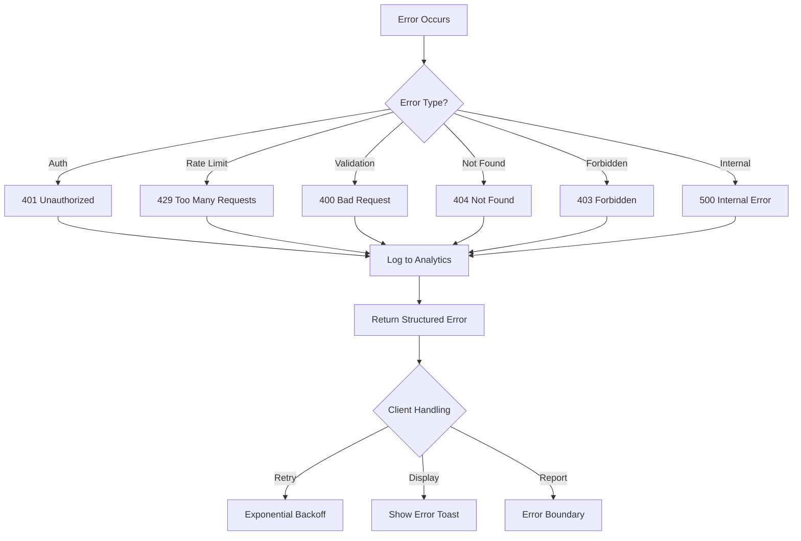
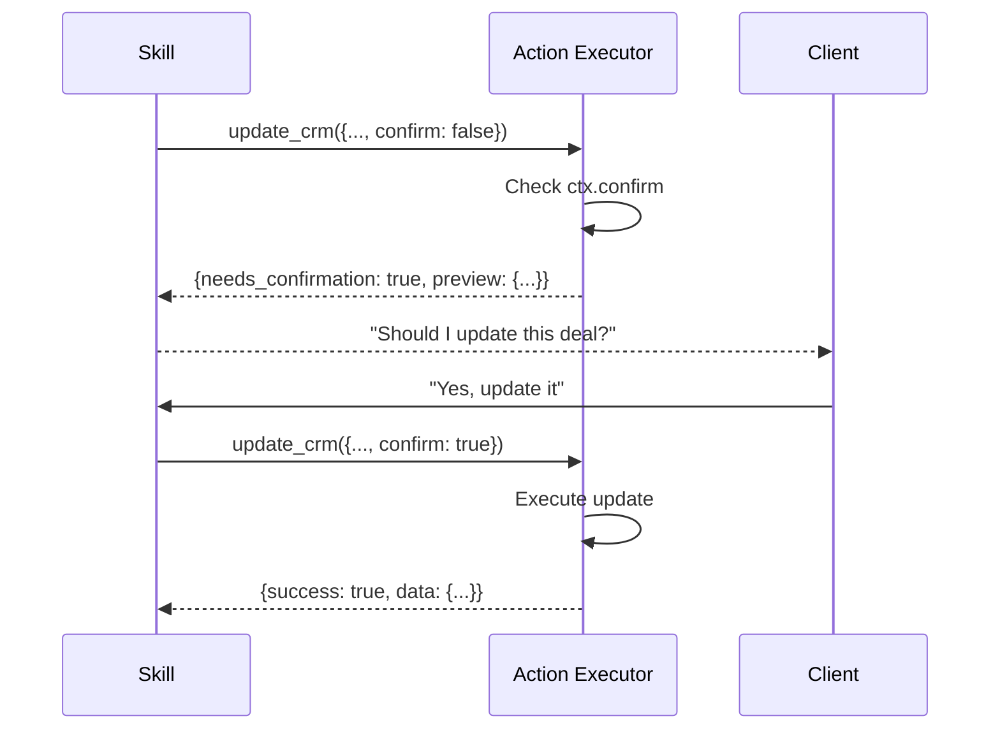

# Copilot Process Map & Safety Architecture

**Version:** 1.1
**Last Updated:** 2026-01-23
**Status:** Production

---

## Executive Summary

The 60 Copilot is an autonomous sales agent that processes user requests through a layered architecture of skills, actions, and integrations. This document maps every step of the process and documents all safety measures.

---

## System Overview

```
┌─────────────────────────────────────────────────────────────────────────────┐
│                              USER REQUEST                                    │
│                        "Send a deal alert to Slack"                          │
└─────────────────────────────────────────────────────────────────────────────┘
                                      │
                                      ▼
┌─────────────────────────────────────────────────────────────────────────────┐
│  LAYER 1: GATEWAY                                                            │
│  ┌─────────────┐  ┌─────────────┐  ┌─────────────┐  ┌─────────────┐        │
│  │ CORS Check  │→ │ Auth Check  │→ │ Rate Limit  │→ │ Org Resolve │        │
│  └─────────────┘  └─────────────┘  └─────────────┘  └─────────────┘        │
└─────────────────────────────────────────────────────────────────────────────┘
                                      │
                                      ▼
┌─────────────────────────────────────────────────────────────────────────────┐
│  LAYER 2: ORCHESTRATOR                                                       │
│  ┌─────────────┐  ┌─────────────┐  ┌─────────────┐  ┌─────────────┐        │
│  │ Context     │→ │ Skill/Seq   │→ │ Gemini 3     │→ │ Tool        │        │
│  │ Building    │  │ Resolution  │  │ Flash Call   │  │ Execution   │        │
│  └─────────────┘  └─────────────┘  └─────────────┘  └─────────────┘        │
└─────────────────────────────────────────────────────────────────────────────┘
                                      │
                                      ▼
┌─────────────────────────────────────────────────────────────────────────────┐
│  LAYER 3: SKILL EXECUTION                                                    │
│  ┌─────────────┐  ┌─────────────┐  ┌─────────────┐  ┌─────────────┐        │
│  │ Skill       │→ │ Action      │→ │ Integration │→ │ Response    │        │
│  │ Template    │  │ Execution   │  │ Call        │  │ Formatting  │        │
│  └─────────────┘  └─────────────┘  └─────────────┘  └─────────────┘        │
└─────────────────────────────────────────────────────────────────────────────┘
                                      │
                                      ▼
┌─────────────────────────────────────────────────────────────────────────────┐
│  LAYER 4: RESPONSE                                                           │
│  ┌─────────────┐  ┌─────────────┐  ┌─────────────┐  ┌─────────────┐        │
│  │ Structured  │→ │ Analytics   │→ │ Conversation│→ │ Client      │        │
│  │ Response    │  │ Logging     │  │ Persistence │  │ Response    │        │
│  └─────────────┘  └─────────────┘  └─────────────┘  └─────────────┘        │
└─────────────────────────────────────────────────────────────────────────────┘
```

---

## Detailed Process Flow

### Phase 1: Request Reception



### Phase 2: Context Building



### Phase 3: Gemini API Interaction



### Phase 4: Skill Execution (with Composition)



### Phase 5: Response & Persistence



---

## Safety Measures Matrix

### Layer 1: Gateway Security

| Check | Implementation | Failure Response |
|-------|---------------|------------------|
| **CORS** | `corsHeaders` validation | 403 Forbidden |
| **Authentication** | JWT validation via Supabase Auth | 401 Unauthorized |
| **Rate Limiting** | 100 req/hour per user | 429 Too Many Requests |
| **Org Membership** | Validate user belongs to org_id | 403 Forbidden |
| **Input Validation** | Check required fields | 400 Bad Request |

### Layer 2: Orchestrator Security

| Check | Implementation | Failure Response |
|-------|---------------|------------------|
| **Conversation Ownership** | user_id match on conversation | Create new conversation |
| **Admin Validation** | `is_admin` check for targetUserId | 403 Forbidden |
| **Message History Limit** | Max 20 messages loaded | Truncate older |
| **Tool Iteration Limit** | Max 10 tool execution loops | Force stop & return |
| **API Key Protection** | Server-side only ANTHROPIC_API_KEY | Never exposed |

### Layer 3: Skill Security

| Check | Implementation | Failure Response |
|-------|---------------|------------------|
| **Skill Access** | Organization has skill enabled | Skill not found error |
| **invoke_skill Depth** | MAX_INVOKE_DEPTH = 3 | Error: Max depth exceeded |
| **Circular Detection** | Parent skill != target skill | Error: Circular invocation |
| **Context Isolation** | Optional `merge_parent_context: false` | Clean context |
| **Timeout** | 30s default per skill | Timeout error |

### Layer 4: Action Security

| Check | Implementation | Failure Response |
|-------|---------------|------------------|
| **Action Allowlist** | ExecuteActionName type | Error: Unknown action |
| **Parameter Validation** | Required params check | Error: Missing param |
| **RLS Enforcement** | All DB queries via Supabase RLS | Empty result |
| **Confirmation Gate** | `ctx.confirm` for write ops | `needs_confirmation: true` |
| **Owner Validation** | user_id/owner_id checks | Not found error |

### Layer 5: Integration Security

| Check | Implementation | Failure Response |
|-------|---------------|------------------|
| **Slack Token Scope** | Limited to org's workspace | 403 from Slack |
| **CRM Data Isolation** | RLS policies on all tables | No data leakage |
| **Enrichment Rate Limit** | Gemini API quotas | Fallback to cached |
| **External API Timeout** | 30s timeout on all calls | Error with retry |

---

## Recursion & Composition Safety

### invoke_skill Safety Checks

```typescript
// 1. Depth Protection
const MAX_INVOKE_DEPTH = 3;

if (currentDepth >= MAX_INVOKE_DEPTH) {
  return {
    success: false,
    error: `Max skill nesting depth (${MAX_INVOKE_DEPTH}) exceeded`
  };
}

// 2. Circular Dependency Detection
if (parentSkill === skillKey) {
  return {
    success: false,
    error: `Circular skill invocation detected: ${skillKey} cannot invoke itself`
  };
}

// 3. Skill Existence Validation
const { data: skillData, error } = await client
  .from('organization_skills')
  .select('...')
  .eq('skill_id', skillKey)
  .eq('org_id', orgId)
  .maybeSingle();

if (!skillData) {
  return { success: false, error: `Skill not found: ${skillKey}` };
}
```

### Valid Skill Chain Example

```
User Request
    │
    ▼
new-lead-workflow (depth: 0)
    │
    ├──► invoke_skill('lead-research') (depth: 1)
    │        │
    │        └──► enrich_contact action (not a skill, OK)
    │
    ├──► invoke_skill('lead-qualification') (depth: 1)
    │
    └──► invoke_skill('slack-blocks') (depth: 1)
             │
             └──► [No further skill calls - pure formatting]
```

### Invalid Skill Chain (Blocked)

```
skill-a (depth: 0)
    │
    └──► invoke_skill('skill-b') (depth: 1)
             │
             └──► invoke_skill('skill-c') (depth: 2)
                      │
                      └──► invoke_skill('skill-d') (depth: 3)
                               │
                               └──► ❌ BLOCKED: Max depth exceeded
```

---

## Error Handling Flow



### Error Response Structure

```typescript
interface ErrorResponse {
  success: false;
  error: {
    message: string;
    code: string;           // e.g., 'UNAUTHORIZED', 'RATE_LIMITED'
    status: number;         // HTTP status code
    details?: {
      stack?: string;       // Only in development
      retryAfter?: number;  // Seconds until retry allowed
    };
  };
}
```

---

## Analytics & Monitoring

### Tracked Metrics

| Metric | Purpose | Alert Threshold |
|--------|---------|-----------------|
| `response_time_ms` | Performance monitoring | > 30,000ms |
| `claude_api_time_ms` | AI latency tracking | > 20,000ms |
| `tool_iterations` | Complexity indicator | > 8 iterations |
| `tools_error_count` | Tool reliability | > 3 errors/request |
| `estimated_cost_cents` | Cost management | > 50 cents/request |
| `input_tokens` | Token usage | > 100,000 |
| `output_tokens` | Token usage | > 10,000 |

### Analytics Schema

```sql
copilot_analytics:
  - user_id
  - conversation_id
  - request_type
  - message_length
  - response_length
  - response_time_ms
  - claude_api_time_ms
  - tool_execution_time_ms
  - tool_iterations
  - tools_used[]
  - tools_success_count
  - tools_error_count
  - estimated_cost_cents
  - input_tokens
  - output_tokens
  - status ('success' | 'error')
  - error_type
  - error_message
  - has_context
  - context_type
```

---

## Rate Limit Configuration

| Endpoint | Window | Max Requests | Message |
|----------|--------|--------------|---------|
| `/api-copilot/chat` | 1 hour | 100 | Rate limit exceeded |
| `/api-copilot/actions/*` | 1 minute | 30 | Admin rate limit exceeded |
| Intensive operations | 1 minute | 10 | Rate limit for intensive ops |
| Auth endpoints | 15 minutes | 5 | Too many auth attempts |

---

## Confirmation Gates

Actions that modify data require explicit confirmation:

| Action | Requires Confirmation | Gate Type |
|--------|----------------------|-----------|
| `update_crm` | Yes | `ctx.confirm === true` |
| `create_task` | Yes | `ctx.confirm === true` (returns preview + needs_confirmation otherwise) |
| `send_notification` | Yes (for external) | `ctx.confirm === true` |
| `invoke_skill` | No | Read-only skill fetch |
| `get_*` actions | No | Read-only |
| `enrich_*` actions | No | Enrichment only |

---

## Deterministic workflow routing (skill-first)

For certain high-frequency UX flows, Copilot intentionally skips the LLM and runs a deterministic workflow to ensure consistent tool-calling and a consistent structured UI:

- **Meetings list (“search meetings”, “meetings today/tomorrow”)** → `execute_action(get_meetings_for_period)` → `meeting_list` structured response
- **Next meeting prep** → `execute_action(run_sequence)` with `seq-next-meeting-command-center` (simulation) → `next_meeting_command_center` structured response
- **Post-meeting follow-up pack** → `execute_action(run_sequence)` with `seq-post-meeting-followup-pack` (simulation) → `post_meeting_followup_pack` structured response

These flows still emit **tool execution telemetry** (`tool_executions`) so the UI can show a real “what happened” trail and a progress stepper.

### Confirmation Flow



---

## Data Flow Security

### Row Level Security (RLS) Enforcement

```sql
-- All queries go through RLS
-- Example: Contacts are isolated to owner
CREATE POLICY "Users can only see own contacts"
ON contacts FOR SELECT
USING (user_id = auth.uid() OR
       org_id IN (SELECT org_id FROM org_members WHERE user_id = auth.uid()));

-- Deals are isolated to org
CREATE POLICY "Org members can see org deals"
ON deals FOR SELECT
USING (org_id IN (SELECT org_id FROM org_members WHERE user_id = auth.uid()));
```

### Data Never Exposed

| Data Type | Protection |
|-----------|------------|
| API Keys | Server-side only, never in responses |
| Other Users' Data | RLS prevents cross-user access |
| Raw Passwords | Never stored (Supabase Auth handles) |
| Tokens | OAuth tokens encrypted at rest |
| Conversation History | User-scoped, not org-scoped |

---

## Deployment Checklist

### Pre-Deployment

- [ ] All RLS policies active
- [ ] Rate limiting table exists
- [ ] Analytics table exists
- [ ] API keys configured in secrets
- [ ] CORS origins configured

### Post-Deployment Verification

- [ ] Auth flow working
- [ ] Rate limiting active
- [ ] Analytics logging
- [ ] Error handling returns proper codes
- [ ] invoke_skill depth limit working

---

## Quick Reference: Safety Limits

| Limit | Value | Reason |
|-------|-------|--------|
| Rate Limit | 100 req/hour | Prevent abuse |
| Tool Iterations | 10 max | Prevent infinite loops |
| Skill Nesting | 3 levels | Prevent recursion bombs |
| Message History | 20 messages | Context window management |
| Response Timeout | 30 seconds | User experience |
| Token Budget | ~100K input | Cost control |

---

## Related Documentation

- [Architecture Overview](./overview.md)
- [Database Schema](../guides/DATABASE_QUERY_ANALYSIS_REPORT.md)
- [Security Audit](../security/SECURITY_AUDIT_RESULTS.md)
- [API Documentation](../api/)
