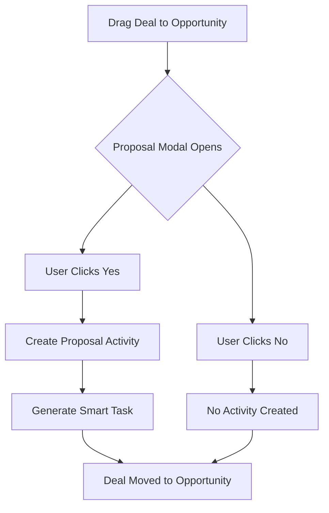

# Workflow Enhancement Documentation

## Overview
This document details the workflow enhancements implemented to improve the sales process, including stage progression updates, smart task automation, enhanced duplicate detection, and mobile optimization.

## 1. Stage Progression Updates

### New Sales Pipeline Flow
```
SQL → Opportunity → Verbal → Signed
```

### Simplified Pipeline Structure
- **Removed Stages**: Lead, Meetings Scheduled, Negotiation, Delivered, Signed & Paid
- **Final 4 Stages**: Streamlined pipeline for clearer progression tracking

### Stage Definitions
1. **SQL (Sales Qualified Lead)**: Initial qualified prospect, validated interest
2. **Opportunity**: Formal proposal has been sent to the client
3. **Verbal**: Verbal agreement reached with the client
4. **Signed**: Deal closed, contract signed

### Key Changes
- **SQL as Starting Point**: SQL (Sales Qualified Lead) is now the initial stage for all deals
- **Opportunity = Proposal**: The Opportunity stage now specifically means a formal proposal has been sent
- **Verbal Before Signed**: Verbal agreement stage moved before final signing
- **Proposal Confirmation Modal**: When dragging a deal to Opportunity, users are prompted:
  - "Have you sent a proposal?"
  - If YES: Creates proposal activity and logs it with follow-up task
  - If NO: Deal moves to Opportunity for proposal preparation (no activity created)

### Database Migration
```sql
-- Simplified stages with proper ordering and colors
SQL:         order_position: 1, color: '#10B981' (green),  probability: 25%
Opportunity: order_position: 2, color: '#8B5CF6' (purple), probability: 60%
Verbal:      order_position: 3, color: '#F59E0B' (orange), probability: 80%
Signed:      order_position: 4, color: '#10B981' (green),  probability: 100%
```

## 2. Smart Tasks System

### Overview
Automated follow-up task generation based on activity triggers to ensure consistent sales processes.

### Features
- **Automatic Task Creation**: Tasks generated when specific activities occur
- **Configurable Templates**: Admin-managed templates with customizable parameters
- **Smart Timing**: Tasks created with appropriate delays (e.g., 3 days after proposal)
- **Priority Management**: Tasks assigned priority levels (low, medium, high, urgent)

### Default Smart Task Templates
| Trigger Activity | Task Created | Days After | Priority |
|-----------------|--------------|------------|----------|
| Proposal | Follow up on proposal | 3 | High |
| Meeting | Send meeting follow-up | 1 | Medium |
| Outbound | Follow up on outreach | 5 | Medium |
| Demo | Demo follow-up | 1 | High |
| Signed | Begin onboarding | 0 | Urgent |

### Admin Management
- **Location**: `/admin/smart-tasks`
- **Permissions**: Admin-only access
- **Capabilities**:
  - Create/Edit/Delete templates
  - Activate/Deactivate templates
  - Configure trigger types and delays
  - Set task priorities and types

### Database Schema
```sql
CREATE TABLE smart_task_templates (
  id UUID PRIMARY KEY,
  trigger_activity_type TEXT NOT NULL,
  task_title TEXT NOT NULL,
  task_description TEXT,
  days_after_trigger INTEGER DEFAULT 3,
  task_type TEXT DEFAULT 'follow_up',
  priority TEXT DEFAULT 'medium',
  is_active BOOLEAN DEFAULT true,
  created_by UUID REFERENCES auth.users(id),
  created_at TIMESTAMP WITH TIME ZONE DEFAULT NOW()
);
```

## 3. Enhanced Duplicate Detection

### Duplicate Warning Modal
- **Clear Explanations**: "Why am I seeing this?" expandable section
- **Visual Matching**: Shows which fields triggered the duplicate detection
- **Similarity Scores**: Displays match confidence percentages
- **Action Options**:
  - Update existing record
  - Create new record anyway
  - Cancel operation

### Fuzzy Matching Implementation
- **String Similarity**: Uses Levenshtein distance algorithm
- **Company Name Normalization**:
  - Removes suffixes (Inc, LLC, Ltd, etc.)
  - Handles special characters
  - Creates variations and acronyms
- **Email Domain Matching**: Compares email domains for company association
- **Phone Number Normalization**: Strips formatting for accurate comparison

### Confidence Scoring
```typescript
// High confidence (>90%): Likely same entity
// Medium confidence (70-90%): Possible match
// Low confidence (<70%): Different entities
```

### Future Phase 4 - AI Enhancement
- Machine learning-based duplicate detection
- Historical pattern analysis
- Cross-field intelligent matching
- Automated merge suggestions

## 4. Mobile Optimization

### Touch-Friendly Interface
- **Minimum Touch Targets**: 44x44px for all interactive elements
- **Action Buttons**: 80px height on mobile for easy thumb access
- **Input Fields**: 48px minimum height with proper padding
- **Quick Date Selection**: 52px buttons for date picking

### Responsive Modal Design
- **Mobile**: Full-width bottom sheet with 92vh max height
- **Desktop**: Centered modal with standard dimensions
- **Swipe Gestures**: Drag down to dismiss on mobile
- **Visual Feedback**: Drag indicator and elastic animations

### Mobile-Specific Features
- **Native Date Pickers**: Uses `datetime-local` input type
- **Smooth Scrolling**: iOS-optimized overflow scrolling
- **Loading States**: Mobile-friendly spinners and feedback
- **Error Display**: Optimized validation messages for small screens

### Performance Optimizations
- **Touch Delay Elimination**: `touch-manipulation` CSS
- **Viewport Control**: Prevents unwanted zooming
- **Input Modes**: Appropriate keyboards for different input types
- **Progressive Enhancement**: Desktop features gracefully degrade

## 5. Activity Creation Flow

### Pipeline Stage Transitions
When moving deals between stages, different activities are created automatically:

1. **Moving to SQL**: Creates "meeting" activity
2. **Moving to Opportunity**: 
   - Shows proposal confirmation modal
   - If user confirms proposal sent: Creates "proposal" activity
   - If user says no proposal sent: No activity created
3. **Moving to Verbal**: No activity created (stage transition only)
4. **Moving to Signed**: Creates "sale" activity with deal value

### Proposal Activity Flow


### Smart Task Generation
When activities are created, smart tasks are automatically generated:
- Proposal activity → "Follow up on proposal" task (3 days later)
- Meeting activity → "Send meeting follow-up" task (1 day later)
- Sale activity → "Begin onboarding" task (same day)

## 6. Component Architecture

### New Components Created
1. **ProposalConfirmationModal** (`/src/components/ProposalConfirmationModal.tsx`)
   - Handles Opportunity stage confirmation
   - Creates proposal activities
   - Triggers smart task generation

2. **DuplicateWarningModal** (`/src/components/DuplicateWarningModal.tsx`)
   - Enhanced duplicate detection UI
   - Clear explanations and actions
   - Similarity scoring display

3. **SmartTasksAdmin** (`/src/pages/SmartTasksAdmin.tsx`)
   - Admin interface for task templates
   - CRUD operations
   - Template activation/deactivation

### Utility Functions
1. **fuzzyMatcher** (`/src/lib/utils/fuzzyMatcher.ts`)
   - String similarity algorithms
   - Company name normalization
   - Duplicate detection logic
   - Merge strategies

## 6. Testing Recommendations

### Unit Tests
- Fuzzy matching algorithm accuracy
- Smart task trigger conditions
- Stage progression logic
- Mobile gesture handlers

### Integration Tests
- Deal stage transitions with activities
- Smart task creation on triggers
- Duplicate detection workflow
- Admin permission checks

### E2E Tests
- Complete sales workflow from SQL to Signed
- Mobile QuickAdd interaction
- Admin smart task management
- Proposal confirmation flow

### Performance Tests
- Mobile rendering performance
- Fuzzy matching on large datasets
- Smart task generation under load
- Modal animation smoothness

## 7. Configuration

### Environment Variables
No new environment variables required.

### Feature Flags (Recommended)
```typescript
const FEATURES = {
  SMART_TASKS: true,
  FUZZY_MATCHING: true,
  MOBILE_OPTIMIZATIONS: true,
  SQL_STAGE: true
};
```

### Admin Settings
- Smart task templates managed via UI
- No code changes needed for task customization
- Role-based access control enforced

## 8. Migration Guide

### For Existing Data
1. Run database migration to add SQL stage
2. Existing Opportunity deals remain unchanged
3. Smart tasks apply to new activities only
4. No impact on historical data

### For Users
1. Sales team training on new SQL stage
2. Admin training for smart task management
3. Mobile app usage guidelines
4. Duplicate detection workflow explanation

## 9. Monitoring & Analytics

### Key Metrics to Track
- Smart task completion rates
- Stage progression velocity
- Duplicate detection accuracy
- Mobile vs desktop usage
- Proposal conversion rates

### Success Indicators
- ↑ Follow-up task completion
- ↓ Duplicate records created
- ↑ Mobile activity logging
- ↑ Proposal-to-close rate
- ↓ Time in each stage

## 10. Future Enhancements

### Phase 2 (Next Sprint)
- Bulk smart task operations
- Custom field matching for duplicates
- Offline mobile support
- Advanced stage rules

### Phase 3 (Q2 2024)
- AI-powered task suggestions
- Predictive duplicate merging
- Voice-to-activity logging
- Custom workflow builders

### Phase 4 (Q3 2024)
- Machine learning duplicate detection
- Natural language task creation
- Cross-platform sync
- Advanced analytics dashboard

## Appendix

### SQL Migrations
- `/supabase/migrations/20241228_add_sql_stage.sql`

### Component Files
- `/src/components/ProposalConfirmationModal.tsx`
- `/src/components/DuplicateWarningModal.tsx`
- `/src/pages/SmartTasksAdmin.tsx`
- `/src/lib/utils/fuzzyMatcher.ts`

### Documentation
- `/docs/quickadd-pipeline-flowcharts.md`
- `/docs/workflow-enhancements.md`

---

**Last Updated**: December 28, 2024
**Version**: 1.0.0
**Status**: Ready for Testing