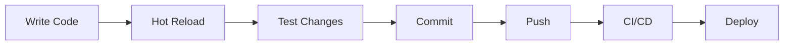
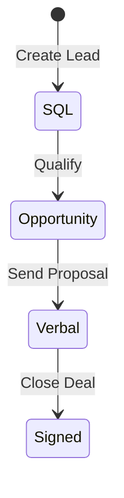

# Quick Start Guide

Get up and running with Sixty Sales Dashboard in 5 minutes.

## Prerequisites

- **Node.js 18+** - [Download](https://nodejs.org/)
- **Supabase Account** - [Sign up](https://supabase.com/)
- **Git** - For version control

## Installation

### 1. Clone the Repository

```bash
git clone [repository-url]
cd sixty-sales-dashboard
```

### 2. Install Dependencies

```bash
npm install
```

### 3. Configure Environment

```bash
# Copy example environment file
cp .env.example .env
```

Edit `.env` with your Supabase credentials:

```env
VITE_SUPABASE_URL=https://your-project.supabase.co
VITE_SUPABASE_ANON_KEY=your-anon-key
```

### 4. Start Development Server

```bash
npm run dev
```

Open [http://localhost:5173](http://localhost:5173) in your browser.

---

## Development Workflow



### Available Scripts

| Command | Purpose |
|---------|---------|
| `npm run dev` | Start development server |
| `npm run build` | Production build |
| `npm run preview` | Preview production build |
| `npm run test` | Run unit tests |
| `npm run playwright` | Run E2E tests |
| `npm run lint` | Check code style |

---

## Project Structure Overview

```
sixty-sales-dashboard/
├── src/                    # Frontend source code
│   ├── components/         # React components
│   ├── pages/              # Page components
│   ├── lib/                # Business logic
│   └── hooks/              # Custom hooks
├── supabase/               # Backend
│   ├── migrations/         # Database migrations
│   └── functions/          # Edge Functions
├── tests/                  # Test files
└── docs/                   # Documentation
```

---

## First Steps After Setup

### 1. Explore the Dashboard

Navigate to the main dashboard to see the sales pipeline and key metrics.

### 2. Understand the Pipeline



### 3. Create Your First Deal

1. Click "Quick Add" button
2. Select "Deal"
3. Fill in deal details
4. Save

### 4. Check Integrations

Go to Settings > Integrations to connect:
- Fathom (meeting transcripts)
- Google Calendar
- Slack

---

## Troubleshooting

### Common Issues

| Issue | Solution |
|-------|----------|
| Port 5173 in use | Kill process or use `npm run dev -- --port 3000` |
| Supabase connection | Check `.env` credentials |
| Type errors | Run `npm run build` to see details |

### Getting Help

- Check [Troubleshooting Guide](../troubleshooting/)
- Review [Architecture Docs](../architecture/)
- Create a GitHub issue

---

## Next Steps

- [Architecture Overview](../architecture/overview.md)
- [Feature Documentation](../features/)
- [API Reference](../api/)
