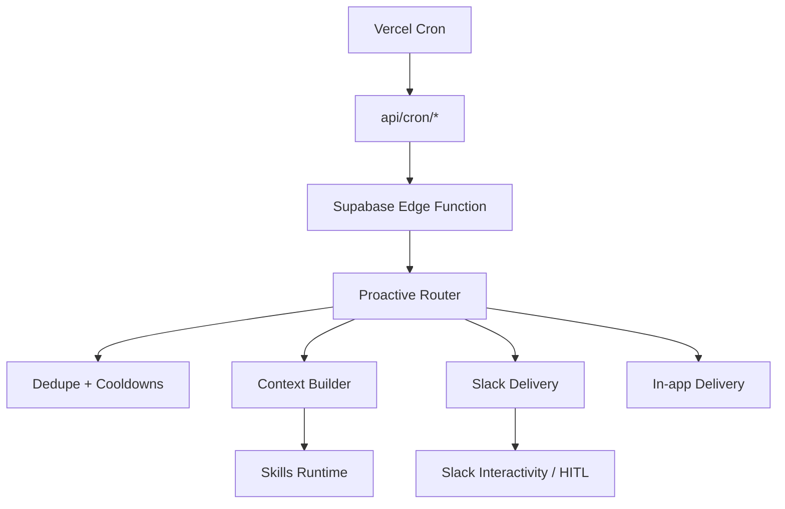

# Proactive 60 Notifications — Implementation Plan (Slack + In‑App)

## Maintenance log
- 2026-01-18: Normalize `create_task` due dates to avoid invalid timestamps from sequences.

## Objective
Build a **proactive notification system** that runs continuously in the background for sales reps, using:
- **Slack** as the primary delivery channel (DMs and optionally channels), with interactive actions and HITL approvals.
- **In‑app notifications** as a mirrored “Notification Center” experience using the new UI design.
- **Skills** as the reasoning/drafting layer to generate high-quality, contextual messages and recommended actions.

This plan intentionally **reuses and unifies** existing Slack and meeting intelligence features already in the repo (meeting prep, daily digest, sales assistant DM, meeting debrief, ghosting detection) instead of adding new one-off pipelines.

---

## Confirmed product decisions (locked)
- **Control model**: **Org-controlled** (admins configure features + schedules). No rep-level opt-in/out in MVP.
- **Delivery strategy**: **Slack DM is primary** and **every Slack notification is mirrored into in‑app notifications**.
- **Phase 1 scope**: **Core 3**
  - Morning Brief
  - Pre‑Meeting Nudge (10 minutes before)
  - Post‑Call Summary + Follow‑up Draft (HITL approve/edit/reject)
- **Also planned immediately after Core 3** (high priority):
  - Sales Assistant Digest (15‑minute)
  - Stale Deal / No‑activity alert
  - Email reply received alert

---

## Existing foundations to leverage

### Slack integration (already built)
- OAuth + workspace setup: `supabase/functions/slack-oauth-callback/index.ts`
- Events API routing: `supabase/functions/slack-events/index.ts`
- Interactivity + modals + HITL approvals: `supabase/functions/slack-interactive/index.ts`
- Slack block builders: `supabase/functions/_shared/slackBlocks.ts`
- Cron pattern (Vercel → API route → Edge Function): `vercel.json`, `api/cron/*`

### Slack settings & tracking tables (already exist)
Created by `supabase/migrations/20251208170000_slack_integration_tables.sql`:
- `slack_org_settings`
- `slack_notification_settings`
- `slack_notifications_sent` (critical for dedupe/cooldowns)
- `slack_user_mappings`

### In-app notifications (already exist)
- DB table: `public.notifications` (migration: `supabase/migrations/20240109_create_notifications_table.sql`)
- Client data layer:
  - `src/lib/services/notificationService.ts`
  - `src/lib/hooks/useNotifications.ts`
- Existing UI (to be replaced with new design):
  - `src/components/NotificationBell.tsx`
  - `src/components/NotificationPanel.tsx`

### Meeting intelligence & signals (already exist)
- Meeting debrief to Slack: `supabase/functions/slack-post-meeting/index.ts`
- Meeting prep card to Slack: `supabase/functions/slack-meeting-prep/index.ts`
- Sales assistant DM: `supabase/functions/slack-sales-assistant/index.ts`
- Ghosting detection (client-side service; may need server runner): `src/lib/services/ghostDetectionService.ts`
- Email categorization data/service: `src/lib/services/emailCategorizationService.ts`

---

## Architecture (unified proactive engine)

### Key principle
**One system** that can output to multiple channels (Slack + in‑app) and can be triggered by multiple sources (cron + events), while enforcing:
- **dedupe**
- **rate limits**
- **safe Slack block rendering**
- **auditable logging**

### Data flow
1. **Trigger** (cron or event) selects candidate notifications.
2. **Evaluate** triggers and build recipient list (org settings + mappings).
3. **Skills** generate structured output (message copy, actions).
4. **Deliver** to Slack (DM/channel) and **mirror into in‑app**.
5. **Record** sent events for dedupe and analytics.

---

## Phases

## Phase 1 (Core 3): ship value fast

### 1) Morning Brief (daily)
**Purpose**: “Start your day” prioritization — meetings, tasks, deal risks, top action items.

**Backend**
- Add Edge Function: `supabase/functions/slack-morning-brief/index.ts`
- Add Slack blocks builder: `buildMorningBriefMessage()` in `supabase/functions/_shared/slackBlocks.ts`
- Add cron API route: `api/cron/slack-morning-brief.ts`
- Add schedule in `vercel.json` (recommended: every 15 minutes)
  - Uses a **timezone window** per org (or per configured timezone) to send at ~08:00 local
  - Uses **dedupe** in `slack_notifications_sent` to avoid multiple sends per day

**In-app mirror**
- For each recipient, insert into `public.notifications`:
  - `category`: `team` or `task` (depending on content)
  - `entity_type`: `digest`
  - `metadata`: include counts + top items
  - `action_url`: deep link to relevant page (agenda / tasks / pipeline)

### 2) Pre‑Meeting Nudge (10 minutes before)
**Purpose**: a lightweight “moment before the meeting” brief with talking points.

**Backend**
- Extend existing Edge Function: `supabase/functions/slack-meeting-prep/index.ts`
  - Update time window to **~10 minutes before**
  - Use existing Slack settings feature `meeting_prep`
- Add/extend org-level config:
  - Add `minutes_before` (or similar) to `slack_notification_settings` for feature `meeting_prep`
  - Add migration under `supabase/migrations/`
- Add cron API route + schedule:
  - `api/cron/slack-meeting-prep.ts`
  - `vercel.json`: every 5 minutes

**In-app mirror**
- Insert a notification row for the meeting owner:
  - `category`: `meeting`
  - `entity_type`: `meeting` / `calendar_event`
  - `entity_id`: meeting/event id when available
  - `action_url`: meeting details route

### 3) Post‑Call Summary + Follow‑up Draft (HITL)
**Purpose**: after transcript is available, deliver summary + tasks + a draft follow-up email with approve/edit/reject.

**Backend**
- Reuse and extend existing Edge Function: `supabase/functions/slack-post-meeting/index.ts`
  - Ensure it can be triggered by cron reliably (scan for new “ready” meetings)
  - Include a **follow-up draft** (Phase 1: included in the message; Phase 1.1: fully HITL-driven send)
- Add cron API route + schedule:
  - `api/cron/slack-post-meeting.ts`
  - `vercel.json`: every 5 minutes

**HITL**
- Use existing HITL patterns already present in:
  - `supabase/functions/slack-interactive/index.ts` (approve/reject/edit flows)
  - `supabase/functions/_shared/slackBlocks.ts` (HITL blocks)
- Implement a callback edge function for “approve” to actually send:
  - `supabase/functions/hitl-send-followup-email/index.ts`
  - Uses existing email integration edge functions (Gmail) and logs results

**In-app mirror**
- Insert a notification row for the meeting owner:
  - `category`: `meeting` or `ai`
  - `metadata`: summary + action items count + “draft created”
  - `action_url`: meeting page (and/or email composer deep link)

---

## Phase 1.5 (immediately after Core 3): unify and expand

### 4) Sales Assistant Digest (15 minutes)
**Purpose**: quick cadence nudges (reply needed, ghost risk, meeting coming up, deal stale).

**Backend**
- Refactor existing: `supabase/functions/slack-sales-assistant/index.ts`
  - Route output through the unified delivery + dedupe logic
  - Ensure action IDs match `slack-interactive`
  - Mirror to in‑app notifications

**Fix required**
- `create_task_from_assistant` is emitted by the assistant DM; ensure it is handled in `supabase/functions/slack-interactive/index.ts` (or align to existing action IDs).

### 5) Stale deal alert
**Backend**
- Add Edge Function: `supabase/functions/slack-stale-deals/index.ts`
  - Finds deals with no activity beyond threshold
  - Posts DM + includes “Create task” and “Open deal” actions
  - Uses `slack_notifications_sent` dedupe (one alert per deal per cooldown)
- Add cron route + schedule in `vercel.json`

### 6) Email reply received alert
**Backend**
- Add Edge Function: `supabase/functions/slack-email-reply-alert/index.ts`
  - Detects new inbound replies (using existing email/event tables)
  - Posts DM with summary + suggested reply + next action
  - Mirror to in‑app

---

## Skills integration (how it fits)

### Goal
Use Skills to standardize quality, tone, and action recommendations across all notification types.

### Constraint
Cron/edge-driven proactive work **cannot depend on user-JWT-only endpoints**. If `api-copilot` requires a user token, proactive needs a **cron-safe runtime**.

### Implementation
- Add shared runtime (Edge/Deno): `supabase/functions/_shared/skillsRuntime.ts`
  - Loads skill templates (org + platform skills)
  - Assembles required context (org + entity data)
  - Calls the LLM to produce **strict JSON**
  - Validates output against lightweight schemas per notification type
- Map notification types → skill keys in code initially (later can be data-driven).

---

## In-app notification center (new design)

### Goal
Replace the current basic notification panel with the provided “new notification center” UI concept.

### Implementation
- Convert `new-notifications-design.jsx` into production TSX:
  - `src/components/notifications/NotificationCenter.tsx`
- Wire it to the existing notification store:
  - Reuse `src/lib/hooks/useNotifications.ts` + `src/lib/services/notificationService.ts`
- Integrate it into the app shell (header bell):
  - Keep `src/components/NotificationBell.tsx` as the entry point
  - Swap `NotificationPanel` for `NotificationCenter`

### Categorization mapping
The DB uses categories like `workflow`, `deal`, `task`, `meeting`, `system`, `team`. The new UI tabs (“All, AI, Tasks, Content, Team”) map roughly to:
- **AI**: meeting debriefs, generated drafts, insights
- **Tasks**: task creation + overdue/due notifications
- **Content**: drafts, meeting notes, collateral suggestions (later)
- **Team**: daily briefs / team-level digests

---

## Dedupe, throttling, and safety rules
- **Do not spam**: every proactive send must write to `slack_notifications_sent` with a deterministic dedupe key (org + type + entity + recipient).
- **Cooldown windows**:
  - Morning brief: 1/day per recipient
  - Meeting prep: 1 per meeting per recipient
  - Post-meeting debrief: 1 per meeting per recipient
  - Stale deal: 1 per deal per cooldown window (e.g. 3–7 days)
  - Sales assistant digest: 1 per 15 min window (or only when “new actionable items” exist)
- **Slack block safety**: use builder helpers in `_shared/slackBlocks.ts` (truncate long text, avoid invalid blocks).
- **Fallback behavior**:
  - If Slack is disconnected or user is unmapped, still create **in-app notification**.
  - If AI key is missing, send a deterministic, non-AI fallback message (existing pattern in `slack-post-meeting`).

---

## Migrations / schema changes
Keep schema changes minimal and additive.
- Add new `slack_notification_settings.feature` values (seed/default disabled):
  - `morning_brief`
  - `sales_assistant` (if not already present)
  - `stale_deal_alert`
  - `email_reply_alert`
- Add `minutes_before` (nullable) for `meeting_prep` feature config (if not already present).

---

## Testing plan

### Backend
- Use existing Slack admin/demo/testing surfaces:
  - `src/pages/admin/SlackDemo.tsx`
  - `src/lib/integrationTesting/suites/slackTests.ts`
- For each function, validate:
  - Slack send succeeds
  - `slack_notifications_sent` row is written
  - `notifications` row is written
  - Dedupe prevents repeats
  - Interactive actions route correctly to `slack-interactive`

### Frontend
- Validate:
  - realtime inserts show instantly in Notification Center
  - unread count updates correctly
  - mark read / mark all read / delete still work

---

## Rollout plan
- Start with one org in “test mode”.
- Enable features incrementally via `slack_notification_settings.is_enabled`.
- Monitor sent volume + action completion rates.
- Add rep-level quiet hours and per-user preferences in Phase 2 if needed.

---

## Acceptance criteria (MVP)
- Morning brief sends on schedule and appears in-app for each recipient.
- Meeting prep sends ~10 minutes before meetings and appears in-app.
- Post-meeting debrief sends when transcript/summary is ready, includes follow-up draft, and supports HITL approve/edit/reject.
- All notifications are deduped and logged.

# Proactive 60 — Full Implementation Plan (Slack + In‑App)

This plan turns the catalogue in `proactive-60-agent-brief.md` into a **production implementation** using your existing:
- Slack integration (OAuth, Events, Interactivity, HITL)
- Supabase Edge Functions + Postgres
- Vercel Cron fanout (`api/cron/*` → edge functions)
- In‑app notifications table (`public.notifications`)
- Skills system (platform/org skill templates) to power drafting and reasoning

---

## Goals

### Product goals
- **Power up 60 to work in the background** for sales reps: detect signals, generate insights, and propose next steps.
- Use **Slack as the primary “conversation channel”** (DM + interactive actions).
- Provide a **new in‑app Notification Center** (based on `new-notifications-design.jsx`) as the history + hub, mirroring Slack notifications.

### Engineering goals
- **Unify** ghosting detection + meeting intelligence + skills + Slack delivery into one coherent system.
- Avoid one‑off functions per feature by introducing a **Proactive Engine** layer (trigger → assemble context → skills → deliver → log).
- Strong guardrails: dedupe, cooldowns, schema‑validated AI outputs, and HITL for risky actions.

---

## Confirmed Phase 1 Scope (from your selections)

- **Morning Brief**
- **Sales Assistant Digest (15‑minute)** (email `to_respond`, ghost risks, upcoming meetings, deal risks)
- **Pre‑Meeting Nudge** (10 minutes before)
- **Post‑Call Summary + Follow‑up Draft (HITL approve/edit/reject)**
- **Stale Deal / No‑activity Alert**
- **Email Reply Received (high urgency)**

**Delivery policy**: **Org-only control** (admins set defaults; reps receive).  
**Channel policy**: **Slack DM primary + always mirror into in‑app**.

---

## Existing Building Blocks (we will reuse)

### Slack integration (already robust)
- OAuth + token storage + workspace user sync: `supabase/functions/slack-oauth-callback/index.ts`
- Events API router + signature verify: `supabase/functions/slack-events/index.ts`
- Interactivity router (buttons/modals) + HITL flows: `supabase/functions/slack-interactive/index.ts`
- Block Kit message builders: `supabase/functions/_shared/slackBlocks.ts`

### Slack configuration + dedupe tables (already exist)
From `supabase/migrations/20251208170000_slack_integration_tables.sql`:
- `slack_org_settings`
- `slack_notification_settings`
- `slack_user_mappings`
- `slack_notifications_sent`

### In‑app notifications (already exist)
DB: `public.notifications` (created in `supabase/migrations/20240109_create_notifications_table.sql`)  
Client data layer:
- `src/lib/services/notificationService.ts`
- `src/lib/hooks/useNotifications.ts`
Current UI (to be replaced by new design):
- `src/components/NotificationBell.tsx`
- `src/components/NotificationPanel.tsx`

### Existing proactive Slack jobs (we should consolidate, not rewrite)
- `supabase/functions/slack-sales-assistant/index.ts` (15‑min action items)
- `supabase/functions/slack-daily-digest/index.ts`
- `supabase/functions/slack-meeting-prep/index.ts`
- `supabase/functions/slack-post-meeting/index.ts` (meeting debrief)

---

## Target Architecture

### Data flow
User action → React component → React Query/Zustand → service layer → Supabase → Postgres  
Proactive background:
Vercel Cron / Webhooks → Edge Functions (service role) → Proactive Engine → Slack + In‑App

### Proactive Engine (shared orchestration layer)
We introduce a shared edge module to standardize:
- **Trigger evaluation** (cron / event / decay)
- **Recipient resolution** (org settings + Slack user mappings)
- **Dedupe and cooldowns** (via `slack_notifications_sent` + optional app-side caps)
- **Multi-channel delivery**:
  - Slack DM (primary)
  - In‑app mirror (`notifications`)
- **Observability** (sync logs, error capture)

Conceptual diagram:

---

## Skills Integration Strategy

### Why this is needed
The current adapter path (`executeAction.send_notification`) is designed for AI-driven orchestration, but cron-driven proactive notifications need a **cron-safe runtime** that:
- does not depend on user JWT-only contexts
- can run with service role safely (no secrets exposed to client)
- outputs strict JSON structures suitable for Slack Block Kit and in-app rendering

### Implementation
Add a shared runtime (edge/Deno):
- loads relevant skill templates (org + platform)
- builds context for the event (meeting/deal/email/etc.)
- calls the model and validates against a schema
- returns structured output:
  - Slack blocks / sections
  - suggested actions (create task, open deal, draft follow-up)
  - in-app payload summary

Guardrails:
- schema validation and truncation (Slack has strict limits)
- fail-soft behavior: if AI fails/unconfigured, send a deterministic fallback message

---

## Phase 1: Work Breakdown

### 0) Foundations (shared utilities)

**0.1 Add Proactive Engine shared module**
- Add `supabase/functions/_shared/proactive/`:
  - `types.ts` (canonical notification types + payload schema)
  - `dedupe.ts` (read/write `slack_notifications_sent` with TTL/cooldowns)
  - `deliverySlack.ts` (DM/channel routing, safe post/update)
  - `deliveryInApp.ts` (insert into `public.notifications`)
  - `settings.ts` (read org slack settings + feature settings)
  - `recipients.ts` (resolve Slack recipients from `slack_user_mappings`)

**0.2 Add Skills runtime (cron-safe)**
- Add `supabase/functions/_shared/skillsRuntime.ts`:
  - `runSkill(skillKey, context) -> structuredJson`
  - schema validation helpers
  - fallback strategy when AI keys missing

Acceptance:
- a single test script/edge function can run the pipeline end-to-end in “test mode” without posting.

---

### 1) Morning Brief (daily)

**Goal**: each rep receives an actionable morning brief in Slack DM, mirrored to in-app.

Implementation:
- Add edge function: `supabase/functions/slack-morning-brief/index.ts`
- Data inputs (minimum viable):
  - today’s meetings (calendar events / meetings)
  - overdue + due-today tasks
  - deals closing soon / at risk
  - top “to_respond” emails (from `email_categorizations`)
- Skills:
  - generate 2–3 insights and “focus today” bullets
  - generate 1–3 suggested actions (task creation, open deal, reply email)
- Slack:
  - DM to mapped users (from `slack_user_mappings`)
  - interactive buttons: “Create task”, “Open in app”
- In-app mirror:
  - `notifications.category = 'team'|'task'|'deal'` as appropriate
  - `action_url` deep links
- Dedupe:
  - one per user per day (store key in `slack_notifications_sent`)

Scheduling:
- Add `api/cron/slack-morning-brief.ts`
- Add Vercel cron entry in `vercel.json` (frequency depends on timezone design; MVP: 15 minutes with a send window)

Acceptance:
- A user with mappings gets exactly one brief per day; no duplicates even if cron retries.

---

### 2) Sales Assistant Digest (15-minute)

**Goal**: frequent, lightweight “what to do next” DMs, using existing `slack-sales-assistant`.

Implementation:
- Refactor `supabase/functions/slack-sales-assistant/index.ts` to route through:
  - shared recipient resolution
  - shared dedupe/cooldowns (avoid spamming)
  - Skills for better copy + better recommended next steps
- Ensure Slack action IDs match `slack-interactive` handlers.
  - Add missing handler(s) in `supabase/functions/slack-interactive/index.ts` if needed.
- In-app mirror for each DM.

Scheduling:
- Keep existing Vercel cron (`api/cron/slack-sales-assistant.ts`) and ensure it uses the same dedupe/caps.

Acceptance:
- Produces a DM with 3–8 items maximum; each item has at least one actionable button.

---

### 3) Pre‑Meeting Nudge (10 minutes before)

**Goal**: targeted prep card shortly before meeting start.

Implementation:
- Update `supabase/functions/slack-meeting-prep/index.ts`:
  - adjust time window to ~10 minutes (e.g., 8–12 min window)
  - generate talking points via Skills runtime (or keep current LLM call, but unify output schemas)
  - DM meeting owner (requires Slack self mapping)
- Mirror to in-app: category `meeting`, action_url to meeting/deal.

Scheduling:
- Add `api/cron/slack-meeting-prep.ts` (or wire into existing cron if present)
- Add Vercel cron in `vercel.json` (every 5 minutes)

Acceptance:
- For a meeting starting in 10 minutes, the owner receives exactly one nudge.

---

### 4) Post‑Call Summary + Follow‑up Draft (HITL)

**Goal**: after transcript/summary is available, deliver summary + draft follow-up; require HITL approval for sending.

Implementation:
- Extend existing `supabase/functions/slack-post-meeting/index.ts` or add `slack-meeting-debrief`:
  - detect “ready” meetings (transcript indexed / summary available)
  - generate:
    - summary
    - action items
    - follow-up draft email
  - create HITL approval request
  - send Slack HITL message (Approve / Edit / Reject)
- Ensure `slack-interactive` routes HITL actions (already implemented) and triggers a callback.
- Add callback edge function:
  - `supabase/functions/hitl-send-followup-email/index.ts`
  - uses Gmail integration edge function(s) to send email (or create as draft first)

Acceptance:
- Approve sends (or drafts) the email; edit opens modal; reject logs.
- Slack message updates to show final status.
- In-app mirror is created for the debrief + status changes.

---

### 5) Stale Deal / No‑Activity Alert

**Goal**: detect deals with no meaningful activity over threshold and prompt next steps.

Implementation:
- Add edge function `supabase/functions/slack-stale-deals/index.ts`
- Data inputs:
  - deals, last activity timestamp, stage, value
  - optionally risk signals
- Skills:
  - suggest 1–2 next actions + outreach angle
- Slack:
  - DM owner, include “Create task” and “Open deal” buttons
- In-app mirror
- Dedupe per deal per time window (e.g., max 1 per 7 days)

Scheduling:
- Add `api/cron/slack-stale-deals.ts` + Vercel cron (daily)

Acceptance:
- Only the owner is notified; dedupe prevents repeated nags.

---

### 6) Email Reply Received (high urgency)

**Goal**: alert when a high-signal inbound reply arrives (or response required).

Implementation:
- Add edge function `supabase/functions/slack-email-reply-alert/index.ts`
- Detect:
  - new inbound email events / new categorizations that imply reply received and action required
- Skills:
  - summarize reply in 1–2 lines
  - propose a response draft (HITL optional for Phase 1; link-out acceptable)
- Slack DM + in-app mirror + dedupe per thread

Scheduling:
- Add `api/cron/slack-email-reply-alert.ts` + Vercel cron (every 5–15 minutes)

Acceptance:
- For new inbound replies, the owner is pinged once with the key context and next action.

---

## In‑App Notification Center (New UI)

### Requirement
Implement the design in `new-notifications-design.jsx` as a real app feature, backed by `public.notifications`.

### Plan
- Create `src/components/notifications/NotificationCenter.tsx` based on the design
- Integrate into app shell (header bell)
- Use existing data layer (`notificationService` + `useNotifications`) and extend if needed
- Map categories to tabs:
  - All
  - AI (meeting insights, drafts)
  - Tasks
  - Content
  - Team

Acceptance:
- Unread badge count works
- Mark read / mark all read works
- Clicking notification navigates to `action_url`
- Real-time inserts update UI

---

## Database & Migrations (Phase 1)

### Slack settings
Add features/settings needed for new triggers:
- Add `feature` values to `slack_notification_settings`:
  - `morning_brief`
  - `stale_deals`
  - `email_reply_alert`
  - (existing) `sales_assistant`, `meeting_prep`, `meeting_debrief`
- Add any additional columns only if needed (keep schema minimal).

### In-app
Reuse `public.notifications` (no new tables required for MVP).

---

## Guardrails

- **No Slack token exposure to frontend** (already handled by RPC pattern in `useSlackOrgSettings`)
- **Use `maybeSingle()`** where records may not exist (avoid PGRST116)
- **Explicit column selection** in edge functions (no `select('*')` for sensitive tables)
- **Dedupe + cooldowns** using `slack_notifications_sent`
- **Caps** to avoid spam (e.g., max N notifications per user per hour/day)
- **Fail-soft AI**: if AI fails/missing keys, send deterministic fallback messages
- **HITL** required for sending email or CRM writes beyond task creation

---

## Observability / Logging

For every proactive run:
- record “attempt” with counts and errors (use existing patterns in edge functions, and `integration_sync_logs` where applicable)
- store Slack dedupe entries on successful sends
- store in-app notifications for each recipient

---

## Testing Strategy

### Backend
- Add “test mode” flags to proactive edge functions:
  - returns payload + recipients without sending Slack
  - still exercises DB reads + skill execution + schema validation

### Slack
- Use existing Slack demo/admin tooling (`src/pages/admin/SlackDemo.tsx`) where possible
- Verify action handlers in `slack-interactive`:
  - create task
  - dismiss
  - HITL approve/edit/reject

### In-app
- Create sample notifications and confirm real-time updates in UI

---

## Rollout Strategy

1) Enable for a single org in “test mode”
2) Verify mappings + dedupe + no spam
3) Enable production crons
4) Expand to additional orgs; monitor volumes and engagement

---

## Deliverables Checklist

- [x] Proactive Engine shared modules (`supabase/functions/_shared/proactive/*`)
- [x] Skills runtime (`supabase/functions/_shared/skillsRuntime.ts`)
- [x] Morning Brief edge function + cron route + vercel schedule
- [ ] Sales Assistant refactor + shared dedupe/caps + in-app mirror *(in-app mirror done; full refactor to shared engine still optional)*
- [x] Meeting Prep adjusted to 10 minutes + schedule
- [x] Post-call debrief + HITL callback to send follow-up email
- [x] Stale deal alerts edge function + schedule
- [x] Email reply alerts edge function + schedule
- [x] In-app Notification Center UI implemented and wired

### Notes / follow-ups
- **Schema alignment**: added `supabase/migrations/20260102000013_proactive_notification_schema_alignment.sql` to support proactive dedupe keys (`dedupe_key`) and feature thresholds (`thresholds`) while remaining additive/backwards-compatible.

